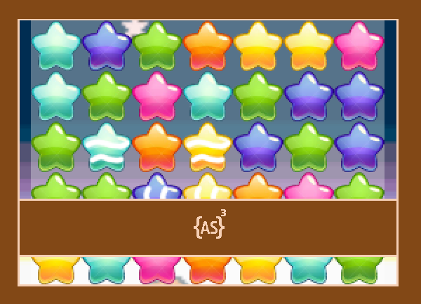
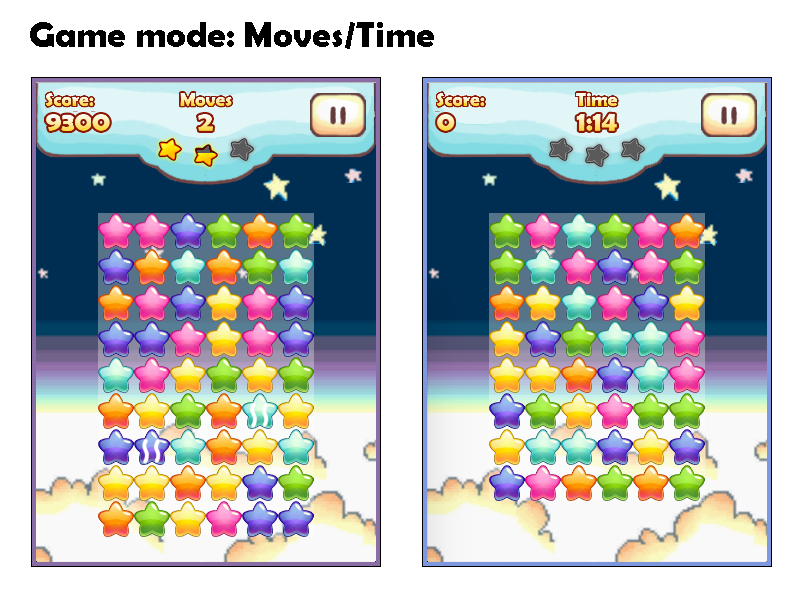
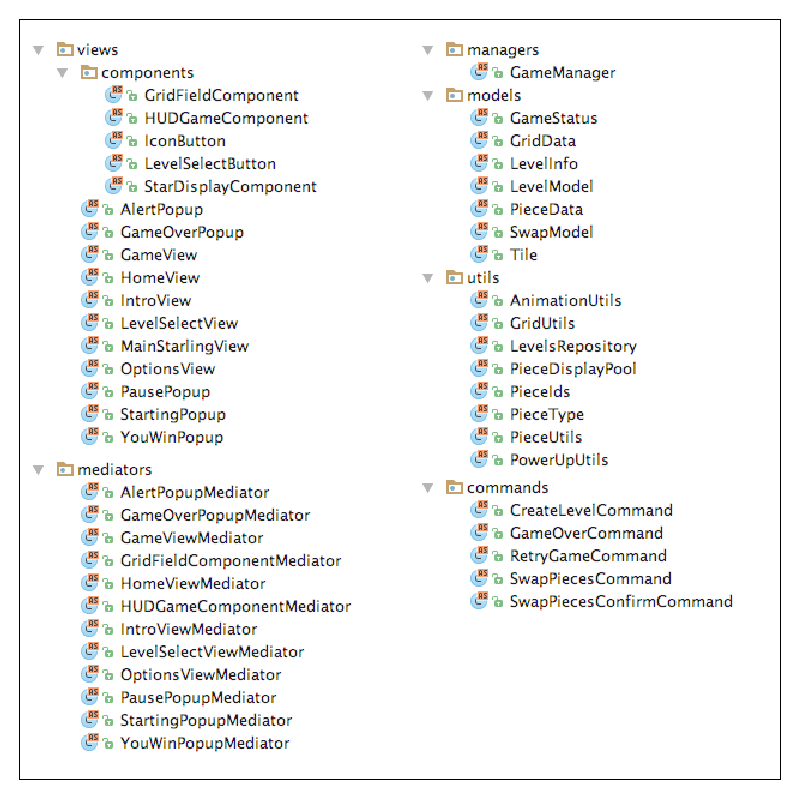
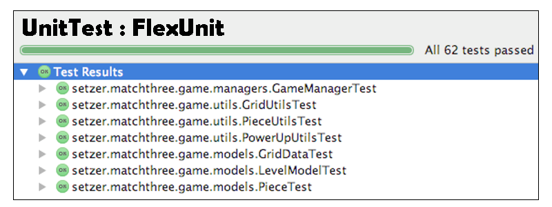
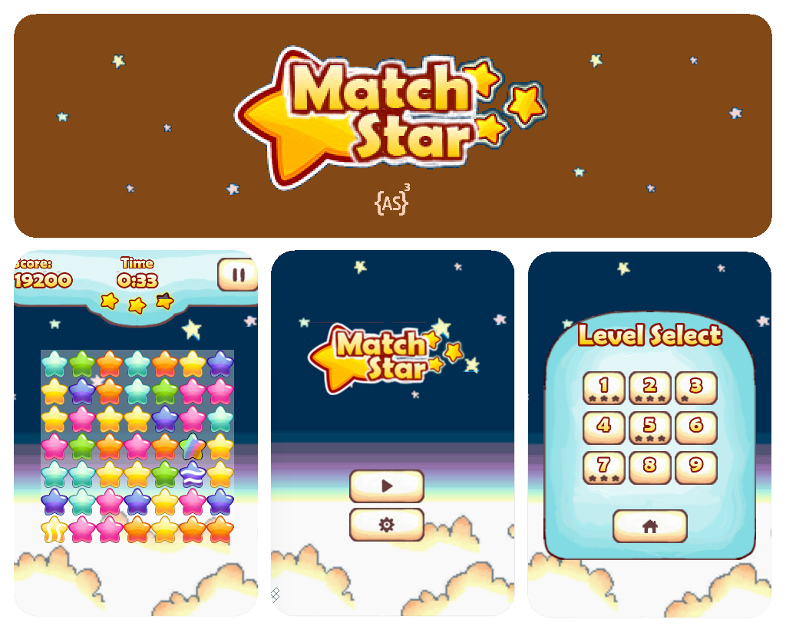

This is a TypeScript open-source game which is a port of the ActionScript version, following the same concepts, graphics, and architecture.

+ **Category:** Arcade.
+ **Platform:** Web.
+ **Language:** TypeScript.
+ **Technologies:** PixiJs, RobotlegsJs, RobotlegsJs-Pixi, Palidor.

* * *

### Gameplay

* * *

### Dependencies

+ [PixiJs](http://www.pixijs.com/)
+ [RobotlegsJs](https://github.com/GoodgameStudios/RobotlegsJS)
+ [Robotlegs-Pixi](https://github.com/GoodgameStudios/RobotlegsJS-Pixi)

* * *

### Demos
+ **[ActionScript](https://ronaldosetzer.github.io/portfolio/open_source/match3_as/)**
+ **[TypeScript](https://ronaldosetzer.github.io/portfolio/open_source/match3_as/)**

* * *

### Game

#### Views - Mediators - Managers - Models - Utils - Commands - Tests

* * *

### Screenshots

* * *

**Ronaldo Santiago**  - Game Developer [ [portfolio](https://ronaldosetzer.github.io/portfolio/) ]
