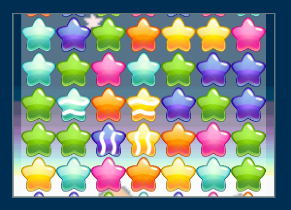
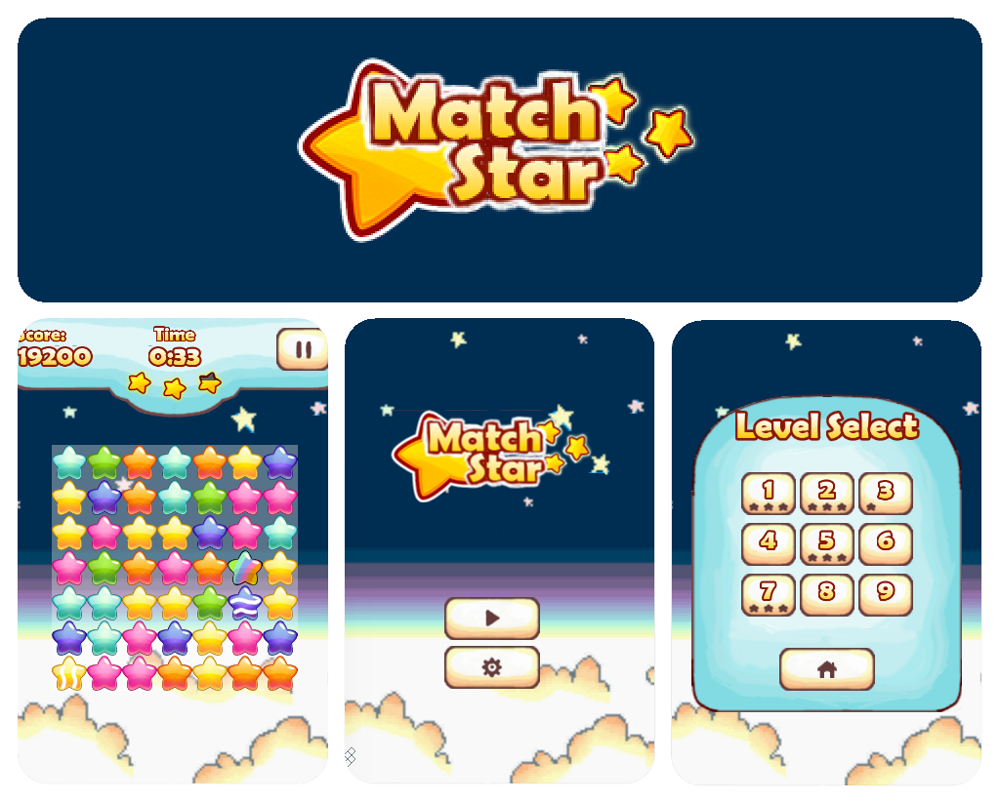

This is an Actionscript open-source game which was designed to shows how to implements Starling, Robotlegs, and Palidor.

+ **Category:** Puzzle.
+ **Platform:** Web.
+ **Language:** Actionscript 3.
+ **Technologies:** StarlingFW, Robotlegs, Palidor, FlexUnit.

* * *

### Dependencies

+ [Starling](https://github.com/Gamua/Starling-Framework)
+ [Robotlegs 2](https://github.com/robotlegs/robotlegs-framework)
+ [Palidor](https://github.com/RonaldoSetzer/robotlegs-extensions-Palidor)

* * *

### Demo
+ **[Actionscript](https://ronaldosetzer.github.io/portfolio/open_source/match3/)**

### Screenshots

* * *

**Ronaldo Santiago**  - Game Developer [ [portfolio](https://ronaldosetzer.github.io/portfolio/) ]
